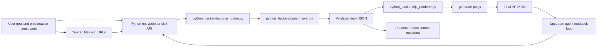

# Auto PPT Prototype

[](https://github.com/lijunliu-gh/auto-ppt-prototype/releases/tag/v0.3.0)
[](LICENSE)
[](https://github.com/lijunliu-gh/auto-ppt-prototype/actions/workflows/smoke.yml)

Open-source PowerPoint backend for AI agents working from trusted sources, uploaded material, and explicit presentation requirements.

Status: experimental prototype for early open-source integration.

Latest release: [v0.3.0](https://github.com/lijunliu-gh/auto-ppt-prototype/releases/tag/v0.3.0)

Quick links:

- [Release notes](https://github.com/lijunliu-gh/auto-ppt-prototype/releases/tag/v0.3.0)
- [Changelog](CHANGELOG.md)
- [Product overview](PRODUCT.en.md)
- [User guide](USER_GUIDE.en.md)
- [Integration guide](INTEGRATION_GUIDE.en.md)

Architecture summary:

- Python plans and revises decks
- JavaScript renders final `.pptx` files
- deck JSON is the stable contract between both layers

## Contents

- [Core Positioning](#core-positioning)
- [What It Does](#what-it-does)
- [Quick Start](#quick-start)
- [Repository Map](#repository-map)
- [Main Interfaces](#main-interfaces)
- [Source Handling](#source-handling)
- [Recommended Usage Model](#recommended-usage-model)
- [Project Boundaries](#project-boundaries)
- [Documentation](#documentation)

## Core Positioning

This repository is now intentionally split into two layers:

- Python smart layer: planning, revision, source ingestion, model calls, and agent-facing orchestration
- JavaScript render layer: validated deck JSON to `.pptx` output with `pptxgenjs`

The recommended mental model is:

`requirements + trusted material -> Python planning -> deck JSON -> JavaScript rendering -> PPTX`

This is an agent backend, not a standalone research agent and not just a local slide script.

## What It Does

The current implementation supports:

1. Prompt-to-deck planning
2. Natural-language deck revision
3. Trusted source ingestion from local files and URLs
4. JSON-schema validation before rendering
5. Agent-callable CLI, JSON skill, and local HTTP service entrypoints
6. PPTX rendering through the Node renderer

## Why The Split Exists

The Python layer is the right place for future intelligence work:

- source understanding
- document parsing
- model orchestration
- retrieval and multimodal expansion
- more advanced revision logic

The JavaScript layer already has a working renderer and remains the stable output engine.

That gives the project a clear boundary:

- Python owns intelligence
- Node owns rendering

## Quick Start

Install dependencies:

```bash
npm install
python -m pip install -r requirements.txt
```

Try the main flows:

```bash
npm run generate
npm run generate:source
npm run revise:mock
npm run skill:create
npm run skill:server
```

## Repository Map

```text
auto-ppt-prototype/
|-- python_backend/
|   |-- smart_layer.py        # planning, revision, validation
|   |-- source_loader.py      # trusted material ingestion
|   |-- skill_api.py          # skill request orchestration
|   `-- js_renderer.py        # bridge into the Node PPTX renderer
|-- py-generate-from-prompt.py
|-- py-revise-deck.py
|-- py-agent-skill.py
|-- py-skill-server.py
|-- generate-ppt.js           # stable PPTX renderer
|-- generate-from-prompt.js   # compatibility wrapper
|-- revise-deck.js            # compatibility wrapper
|-- agent-skill.js            # compatibility wrapper
|-- skill-server.js           # compatibility wrapper
|-- deck-schema.json          # deck JSON contract
|-- skill-manifest.json       # skill integration contract
|-- sample-*.json             # sample requests and payloads
|-- README.md
|-- PRODUCT.*.md
|-- USER_GUIDE.*.md
|-- INTEGRATION_GUIDE.*.md
|-- CHANGELOG.md
|-- RELEASE_DRAFT_v0.3.0.md
|-- .github/
|   `-- workflows/
|       `-- smoke.yml
`-- scripts/
    `-- run-smoke.js
```

The practical split is:

- `python_backend/` owns planning, revision, source understanding, and agent-facing orchestration
- root-level `py-*.py` files are the primary public entrypoints
- `generate-ppt.js` is the stable PPTX renderer
- root-level Node CLIs remain compatibility wrappers for older integrations

## End-To-End Flow



The operational flow is:

- an upstream agent or caller provides the deck goal and any presentation constraints
- trusted source material is loaded and normalized before planning
- the Python layer produces or revises validated deck JSON
- the JavaScript renderer turns that deck JSON into the final PPTX
- revision requests loop back into the same Python planning surface

## Main Interfaces

### Python-first CLI

Create a deck:

```bash
python py-generate-from-prompt.py --mock --prompt "Create an 8-slide product strategy deck"
```

Revise a deck:

```bash
python py-revise-deck.py --mock --deck output/py-generated-deck.json --prompt "Compress this deck to 6 slides"
```

### Compatibility Node CLI

These files still exist for backward compatibility, but they now forward into the Python smart layer:

- `generate-from-prompt.js`
- `revise-deck.js`
- `agent-skill.js`
- `skill-server.js`

### JSON Skill

```bash
python py-agent-skill.py --request sample-agent-request.json --response output/py-agent-response.json
```

### HTTP

Start the default service:

```bash
npm run skill:server
```

Call the endpoint:

```bash
curl -X POST http://localhost:3010/skill -H "Content-Type: application/json" --data @sample-http-request.json
```

## Source Handling

Supported source types:

- local text-like files: `.txt`, `.md`, `.csv`, `.json`, `.yaml`, `.xml`
- local HTML
- local PDF
- local DOCX
- image references
- HTTP and HTTPS URLs

Current default behavior:

- slide body stays clean
- sources are preserved in structured slide metadata
- sources are exported into presenter notes

The default output mode is `sourceDisplayMode = notes`.

## Recommended Usage Model

The intended flow is:

1. an upstream agent collects the user goal and constraints
2. the upstream agent gathers trusted material
3. the Python smart layer plans or revises the deck JSON
4. the Node renderer produces the final PPTX
5. the upstream agent calls revise again when feedback arrives

## Project Boundaries

This repository is not yet:

- a full autonomous research agent
- a complete OCR or multimodal system
- a production-grade brand template engine
- a fine-grained bullet-level provenance mapper

Those responsibilities should remain with the upstream agent or surrounding workflow.

## Documentation

- `README.md`: repository entry and quick navigation
- `PRODUCT.*.md`: product framing and open-source positioning
- `USER_GUIDE.*.md`: end-user usage guidance
- `INTEGRATION_GUIDE.*.md`: agent and system integration guidance
- `CHANGELOG.md`: version history and release tracking
- `RELEASE_DRAFT_v0.3.0.md`: editable source for the current public release notes

## Read Next

- `PRODUCT.en.md` for product framing
- `USER_GUIDE.en.md` for user-oriented instructions
- `INTEGRATION_GUIDE.en.md` for integration details
- `GITHUB_SETUP.md` for repository metadata and release copy
- `PUBLISH_CHECKLIST.md` for the pre-publish checklist

## License

MIT. See `LICENSE`.
