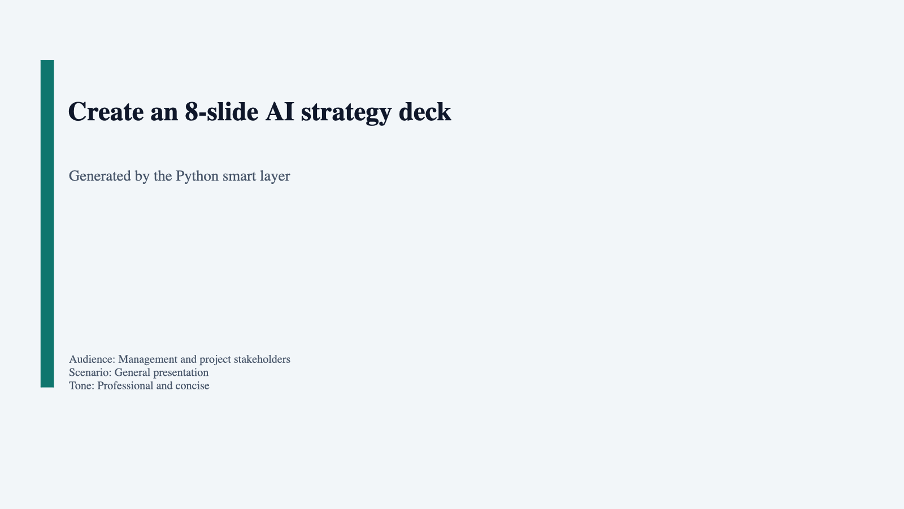
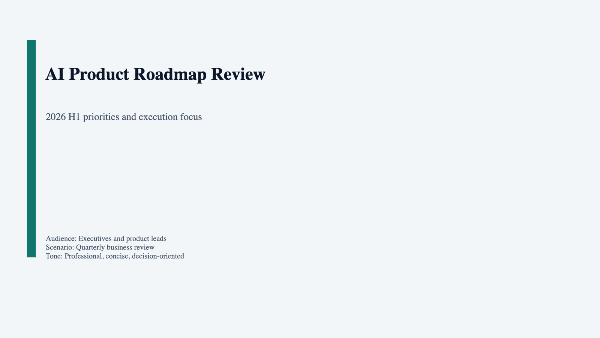
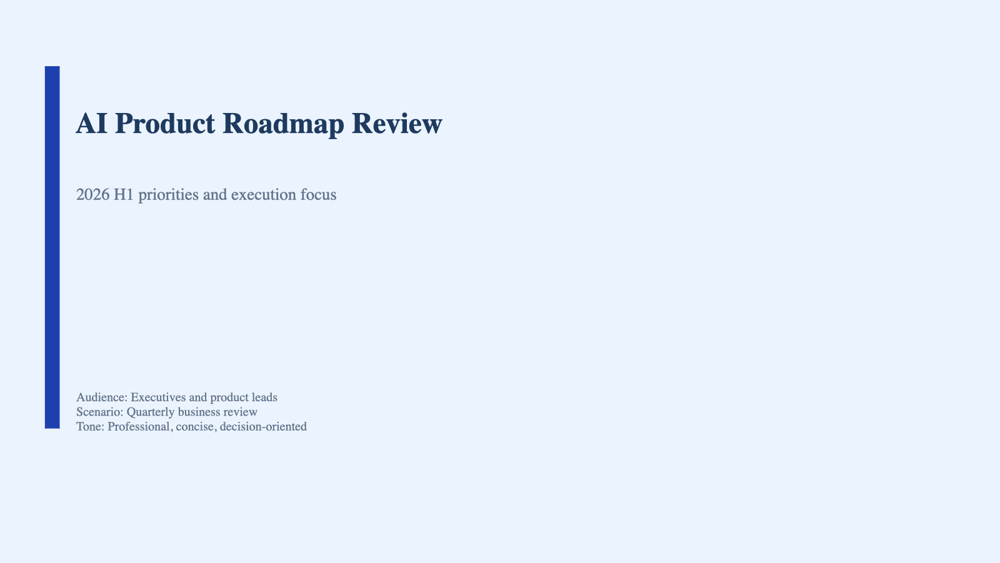
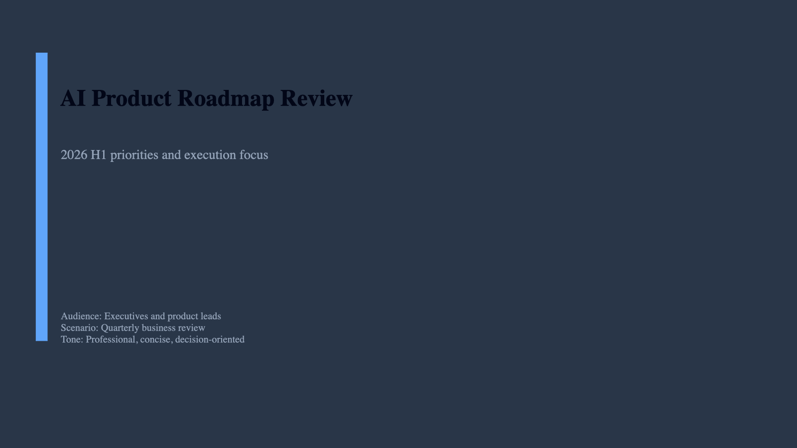
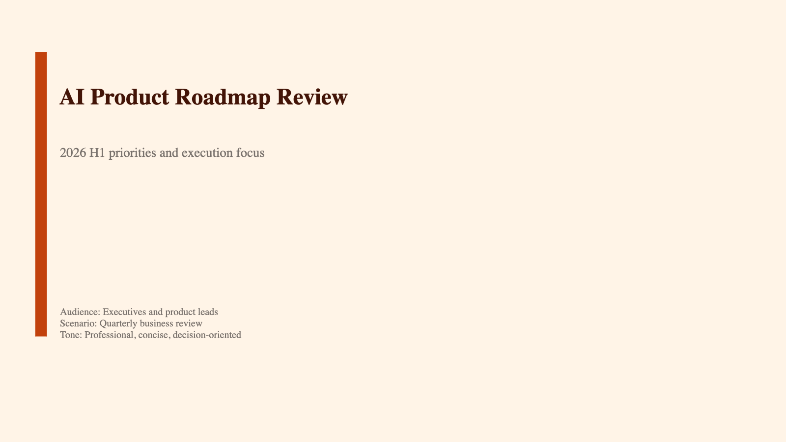
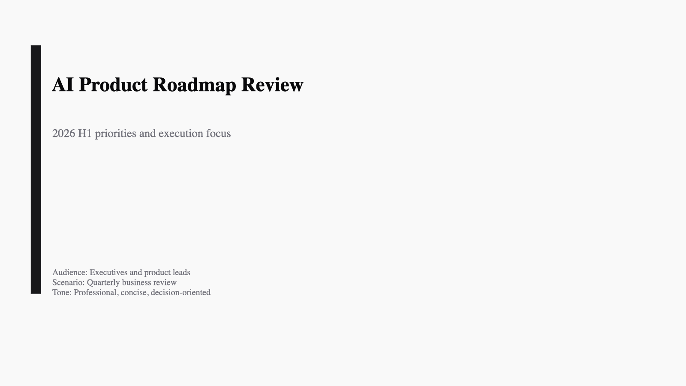
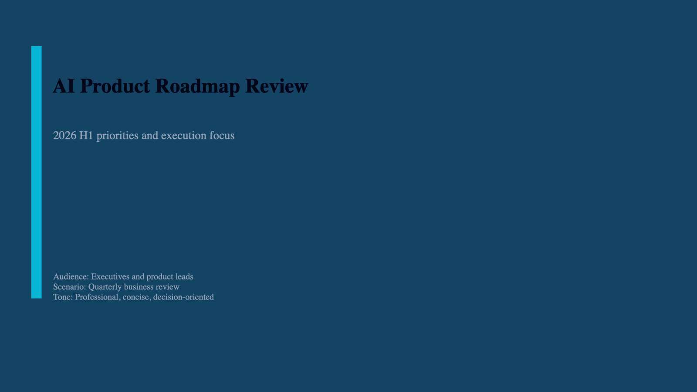

# Auto PPT Engine

<p align="center">
  <a href="https://github.com/lijunliu-gh/auto-ppt-engine/tags"></a>
  <a href="LICENSE"></a>
  <a href="https://github.com/lijunliu-gh/auto-ppt-engine/actions/workflows/smoke.yml"></a>
  <a href="tests/"></a>
  <a href="tests/"></a>
  <br>
  <a href="requirements.txt"></a>
  <a href="package.json"></a>
  <a href="Dockerfile"></a>
  <a href="mcp_server.py"></a>
  <a href="CONTRIBUTING.md"></a>
</p>

Generate and revise editable PowerPoint decks from prompts, source files, or agent tool calls.

Auto PPT Engine is a self-hostable backend for teams that want AI agents, internal tools, or automation workflows to produce `.pptx` output through MCP, CLI, HTTP, or Docker.

> Status: beta-quality open-source backend.
> Not a SaaS. Not a polished end-user GUI.
> Built for agent workflows, internal automation, and custom integrations.
> Current scope is feature-complete enough to evaluate today: prompt in, validated deck JSON and `.pptx` out.

### Why use it?

- Turn a prompt or a source brief into an editable `.pptx` deck
- Let an AI agent create or revise slides through MCP, HTTP, or a JSON skill entrypoint
- Keep generation in your own environment with self-hosted deployment options
- Add engineering guardrails: schema validation, chart fallback, visual QA, and theme-aware rendering

### Who is this for?

| You are… | What this gives you |
|:---|:---|
| **AI agent builder** | A PowerPoint tool backend your agent can call through MCP, HTTP, or file-based orchestration |
| **Developer / power user** | A CLI you can script into report generation, review loops, or internal workflows |
| **Technical team** | A self-hostable service for deck generation with controllable prompts, sources, themes, and outputs |

> **This is the backend behind “generate me a PPT”.** It is designed to be embedded into your workflow, not used as a standalone SaaS product.

## Quick Start

Prerequisites: Python 3.10+ and Node.js 18+.

### Fastest path: mock mode, no API key required

```bash
# 1. Install dependencies
npm install && pip install .

# 2. Generate a deck locally without any LLM key
./auto-ppt generate --mock \
  --prompt "Create an 8-slide AI strategy deck for executives" \
  --source examples/inputs/sample-source-brief.md
```

Output:

- `output/py-generated-deck.json`
- `output/py-generated-deck.pptx`

### Real model generation

```bash
# 1. Configure your LLM key into .env
./auto-ppt init

# 2. Generate with a real model
./auto-ppt generate \
  --prompt "Create an 8-slide AI strategy deck for executives" \
  --source examples/inputs/sample-source-brief.md
```

### Revise and validate

```bash
# Revise an existing generated deck
./auto-ppt revise \
  --deck output/py-generated-deck.json \
  --prompt "Compress to 6 slides, make it more conclusion-driven"

# Run visual QA on the rendered PPTX
./auto-ppt qa-visual output/py-generated-deck.pptx --strict
```

`qa-visual` writes a JSON report (default: alongside PPTX in `<deck-name>-qa/visual-qa-report.json`) and attempts to export slide images when `soffice` and `pdftoppm` are available.

## Example Run

```
$ ./auto-ppt generate --mock --prompt "Q1 AI Strategy Review for Leadership"

Action: create
Deck JSON: output/py-generated-deck.json
PPTX:      output/py-generated-deck.pptx
Renderer:  pptxgenjs
Slides:    8
Sources:   1

  1. [title       ] Q1 AI Strategy Review for Leadership
  2. [agenda      ] Agenda
  3. [bullet      ] Background and goals
  4. [two-column  ] Current state and challenges
  5. [process     ] Python smart layer workflow
  6. [timeline    ] Execution timeline
  7. [chart       ] Adoption metrics
  8. [closing     ] Key recommendations
```

The output is not just a `.pptx` file. The system also emits a validated deck JSON contract that can be revised, re-rendered, audited, or handed to another workflow step.

## Example Output

These thumbnails were generated from real `.pptx` files already in the repository under `output/`.

| Generated deck | Generated deck | Revised deck |
|---|---|---|
|  |  |  |
| `output/py-agent-generated-deck.pptx` | `output/audit-generate.pptx` | `output/py-agent-revised-deck.pptx` |

## Theme Gallery

The 6 built-in themes below are shown using generated PPTX thumbnails from the repository.

| business-clean | corporate-blue | dark-executive |
|---|---|---|
|  |  |  |

| warm-modern | minimal | tech |
|---|---|---|
|  |  |  |

## Quality Pipeline

```
prompt + sources -> planning -> schema validation -> PPTX render -> visual QA -> editable .pptx
```

Quality controls already in the repository include:

- JSON schema validation before rendering
- Chart repair and fallback when chart data is invalid
- Visual QA heuristics for overlap, edge crowding, and empty-slide detection
- Theme-aware text/background contrast handling across light and dark themes

## What It Does

| Capability | Detail |
|-----------|--------|
| Prompt-to-deck planning | Natural-language prompt → structured slide deck |
| Natural-language revision | Iterate on an existing deck with free-text instructions |
| Source ingestion | `.txt` `.md` `.csv` `.json` `.yaml` `.xml` `.html` `.pdf` `.docx`, images, URLs |
| Schema validation | JSON-schema check before every render |
| LLM providers | OpenAI, OpenRouter, Claude, Gemini, Qwen, DeepSeek, GLM, MiniMax, any OpenAI-compatible endpoint |
| PPTX rendering | JS renderer (pptxgenjs) with CJK font support and chart image fallback for Keynote/Google Slides |
| Cross-platform charts | Image-based charts by default; native OOXML via `--native-charts` |
| Built-in themes | 6 themes (business-clean, corporate-blue, dark-executive, warm-modern, minimal, tech); `--theme` flag or API param |
| Multi-language | CJK + Latin universal font stack — any language mixed with English |
| Security | Path traversal protection, SSRF blocking, file size limits, subprocess timeout |

## Entry Points

| Interface | Command | Use Case |
|----------|---------|----------|
| **MCP** | `python mcp_server.py` | Claude Desktop, Cursor, Windsurf — **recommended for agent integration** |
| **CLI** | `./auto-ppt generate` / `revise` | Interactive or scripted usage |
| **HTTP** | `python py-skill-server.py` | REST integration (`POST /skill`) |
| **JSON skill** | `python py-agent-skill.py --request req.json` | File-based agent orchestration |
| **Docker** | `docker compose up --build` | One-command deploy |

## MCP Configuration

**Claude Desktop** — add to `claude_desktop_config.json`:

```json
{
  "mcpServers": {
    "auto-ppt": {
      "command": "python",
      "args": ["/absolute/path/to/auto-ppt-engine/mcp_server.py"]
    }
  }
}
```

**Cursor / Windsurf** — add to `.cursor/mcp.json` or `.windsurf/mcp.json`:

```json
{
  "mcpServers": {
    "auto-ppt": {
      "command": "python",
      "args": ["/absolute/path/to/auto-ppt-engine/mcp_server.py"]
    }
  }
}
```

Tools exposed: `create_deck`, `revise_deck`. Both accept `sources`, `mock` mode, and optional `output_dir`.

## Docker

```bash
export OPENAI_API_KEY="sk-..."
docker compose up --build                          # HTTP skill server
docker run --rm -it -e OPENAI_API_KEY auto-ppt-engine python mcp_server.py  # MCP stdio
```

## Testing

```bash
python -m pytest tests/ -v   # 408 tests
npm run ci:smoke             # JS renderer + end-to-end smoke
```

CI: pytest on Python 3.10 / 3.11 / 3.12, smoke on Node.js 18 / 20 / 22.

## Architecture

```
prompt + sources ➜ Python smart layer ➜ deck JSON ➜ PPTX renderer ➜ .pptx
                        ↑ revise loop ↲
```

- **Python** (`python_backend/`): planning, revision, source loading, LLM calls, schema validation
- **Node** (`generate-ppt.js`): pptxgenjs rendering from validated deck JSON, cross-platform chart images, CJK font stack
- **deck JSON**: the stable contract between both layers

## Documentation

| Doc | Content |
|-----|---------|
| [Examples](docs/EXAMPLES.en.md) | Copy-paste usage flows |
| [User Guide](docs/USER_GUIDE.en.md) | Day-to-day usage |
| [Integration Guide](docs/INTEGRATION_GUIDE.en.md) | HTTP, MCP, JSON skill patterns |
| [Changelog](CHANGELOG.md) | Version history |
| [Roadmap](ROADMAP.md) | Current scope, maintenance status, and version history |

Multilingual: all guides available in [English](docs/EXAMPLES.en.md), [中文](docs/EXAMPLES.zh-CN.md), [日本語](docs/EXAMPLES.ja.md).

## Acknowledgments

Built with the assistance of [Claude](https://claude.ai/) (Anthropic) and [GitHub Copilot](https://github.com/features/copilot).

## License

Apache 2.0 — see [LICENSE](LICENSE) for details.
