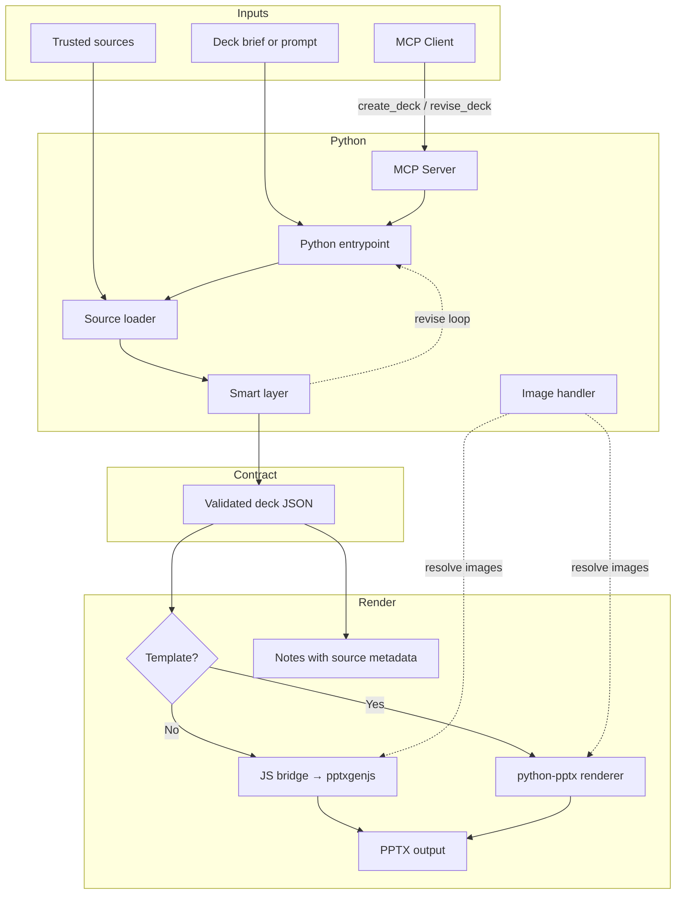

# Auto PPT Prototype

[](https://github.com/lijunliu-gh/auto-ppt-prototype/releases)
[](LICENSE)
[](https://github.com/lijunliu-gh/auto-ppt-prototype/actions/workflows/smoke.yml)

Open-source PowerPoint backend for AI agents working from trusted sources, uploaded material, and explicit presentation requirements.

Status: experimental prototype for early open-source integration.

Latest release: [v0.7.0](https://github.com/lijunliu-gh/auto-ppt-prototype/releases/tag/v0.7.0)

Quick links:

- [Release notes](https://github.com/lijunliu-gh/auto-ppt-prototype/releases/tag/v0.7.0)
- [Changelog](CHANGELOG.md)
- [Roadmap](ROADMAP.md)
- [Examples (EN)](EXAMPLES.en.md)
- [Examples (ZH)](EXAMPLES.zh-CN.md)
- [Examples (JA)](EXAMPLES.ja.md)
- [Product overview](PRODUCT.en.md)
- [User guide](USER_GUIDE.en.md)
- [Integration guide](INTEGRATION_GUIDE.en.md)

## Start Here

- New here and want a PPT in a few minutes: start with the 3-minute Quick Start below.
- Want to understand the input format: inspect `sample-deck-brief.md` and `sample-deck-brief.json`.
- Want integration instead of manual CLI usage: start with `sample-agent-request.json` or `sample-http-request.json`.

Architecture summary:

- Python plans and revises decks
- JavaScript renders final `.pptx` files
- deck JSON is the stable contract between both layers

## Contents

- [3-Minute Quick Start](#3-minute-quick-start)
- [Core Positioning](#core-positioning)
- [What It Does](#what-it-does)
- [Quick Start](#quick-start)
- [MCP Server](#mcp-server)
- [Repository Map](#repository-map)
- [Testing](#testing)
- [End-To-End Flow](#end-to-end-flow)
- [Main Interfaces](#main-interfaces)
- [Source Handling](#source-handling)
- [Recommended Usage Model](#recommended-usage-model)
- [Project Boundaries](#project-boundaries)
- [Documentation](#documentation)
- [License](#license)

## Core Positioning

This repository is now intentionally split into two layers:

- Python smart layer: planning, revision, source ingestion, model calls, and agent-facing orchestration
- JavaScript render layer: validated deck JSON to `.pptx` output with `pptxgenjs`

The recommended mental model is:

`requirements + trusted material -> Python planning -> deck JSON -> JavaScript rendering -> PPTX`

This is an agent backend, not a standalone research agent and not just a local slide script.

## Who This Is For

- teams building AI agents that need PPT output
- developers who want a local PPT generation backend
- workflows that start from trusted files, URLs, or structured briefs
- users who want first-draft generation plus revision loops

## Who This Is Not For

- users looking for a hosted end-user SaaS product
- users expecting a fully autonomous research agent
- teams that need production-grade brand template control today
- users who only want a lightweight markdown-to-slides converter

## What It Does

The current implementation supports:

1. Prompt-to-deck planning
2. Natural-language deck revision
3. Trusted source ingestion from local files and URLs
4. JSON-schema validation before rendering
5. Agent-callable CLI, JSON skill, and local HTTP service entrypoints
6. PPTX rendering through the Node renderer
7. Pluggable LLM provider layer (OpenAI, OpenRouter, Claude, Gemini, and OpenAI-compatible endpoints)
8. Security hardening: path traversal protection, SSRF blocking, file size limits, subprocess timeout
9. Structured logging across the Python backend
10. Schema versioning for forward-compatible deck migration
11. MCP Server for native integration with Claude Desktop, Cursor, Windsurf, and other MCP-compatible environments
12. API versioning (`apiVersion: "1.0"`) in all requests and responses

## 3-Minute Quick Start

If this is your first time using the project, do only these steps.

### 1. Install dependencies

```bash
npm install
python -m pip install -r requirements.txt
```

### 2. Initialize local config

```bash
./auto-ppt init
```

This writes a local `.env` file with your provider key, default model, and default output directory.

If you only want to prove the pipeline works before configuring a real model, you can skip `init` and use `--mock` in the next step.

### 3. Generate your first deck

Mock mode, fastest proof that the repo works:

```bash
./auto-ppt generate --mock --prompt "Create an 8-slide AI workspace strategy deck for executives" --source sample-source-brief.md
```

Real model, after `init`:

```bash
./auto-ppt generate --prompt "Create an 8-slide AI workspace strategy deck for executives" --source sample-source-brief.md
```

### 4. Revise the generated deck

```bash
./auto-ppt revise --deck output/py-generated-deck.json --prompt "Compress this deck to 6 slides and make it more conclusion-driven"
```

What you should expect after a successful run:

- `output/py-generated-deck.json`
- `output/py-generated-deck.pptx`
- `output/py-revised-deck.json`
- `output/py-revised-deck.pptx`

After this first run, keep reading if you need MCP, HTTP service, templates, Docker, or deeper integration.

## Why The Split Exists

The Python layer is the right place for future intelligence work:

- source understanding
- document parsing
- model orchestration
- retrieval and multimodal expansion
- more advanced revision logic

The JavaScript layer already has a working renderer and remains the stable output engine.

That gives the project a clear boundary:

- Python owns intelligence
- Node owns rendering

## Quick Start

This section lists the main entrypoints after your first successful run.

Install dependencies:

```bash
npm install
python -m pip install -r requirements.txt
```

### 1. Official CLI first run

Initialize local config once:

```bash
./auto-ppt init
```

This writes a local `.env` file with your provider key, default model, and default output directory.

Then generate your first deck:

```bash
./auto-ppt generate --mock --prompt "Create an 8-slide AI workspace strategy deck for executives" --source sample-source-brief.md
```

### 2. Revise the generated deck

```bash
./auto-ppt revise --deck output/py-generated-deck.json --prompt "Compress this deck to 6 slides and make it more conclusion-driven"
```

The legacy scripts (`py-generate-from-prompt.py`, `py-revise-deck.py`) remain available, but `auto-ppt` is now the official user-facing CLI entrypoint.

### 3. File-based agent integration

```bash
python py-agent-skill.py --request sample-agent-request.json --response output/py-agent-response.json
```

### 4. Local HTTP service

```bash
python py-skill-server.py
curl -X POST http://localhost:3010/skill -H "Content-Type: application/json" --data @sample-http-request.json
```

### 5. MCP Server (Claude Desktop / Cursor / Windsurf)

```bash
python mcp_server.py
```

Or use the MCP dev inspector:

```bash
mcp dev mcp_server.py
```

See [MCP Server](#mcp-server) below for client configuration.

### 6. npm shortcuts

```bash
npm run generate
npm run generate:source
npm run revise:mock
npm run skill:create
npm run skill:server
```

Useful starter files:

- `sample-source-brief.md`: shortest source-grounded example
- `sample-deck-brief.md`: natural-language deck brief example
- `sample-deck-brief.json`: structured deck brief example
- `sample-agent-request.json`: JSON skill request example
- `sample-http-request.json`: HTTP request example

If you want copy-paste usage flows, start with `EXAMPLES.en.md`, `EXAMPLES.zh-CN.md`, or `EXAMPLES.ja.md`.

## MCP Server

The MCP server exposes `create_deck` and `revise_deck` as native MCP tools, enabling direct integration with Claude Desktop, Cursor, Windsurf, and other MCP-compatible AI environments.

### Claude Desktop configuration

Add to `~/Library/Application Support/Claude/claude_desktop_config.json` (macOS) or `%APPDATA%\Claude\claude_desktop_config.json` (Windows):

```json
{
  "mcpServers": {
    "auto-ppt": {
      "command": "python",
      "args": ["/absolute/path/to/auto-ppt-prototype/mcp_server.py"]
    }
  }
}
```

### Cursor / Windsurf configuration

Add to `.cursor/mcp.json` or `.windsurf/mcp.json` in your project root:

```json
{
  "mcpServers": {
    "auto-ppt": {
      "command": "python",
      "args": ["/absolute/path/to/auto-ppt-prototype/mcp_server.py"]
    }
  }
}
```

### Available tools

| Tool | Description |
|------|-------------|
| `create_deck` | Create a new PowerPoint deck from a natural-language prompt |
| `revise_deck` | Revise an existing deck based on a natural-language instruction |

Both tools accept `sources` (file paths or URLs), `mock` mode for offline testing, and optional `output_dir`.

## Repository Map

```text
auto-ppt-prototype/
|-- python_backend/
|   |-- __init__.py            # package init + version metadata
|   |-- smart_layer.py        # planning, revision, validation
|   |-- source_loader.py      # trusted material ingestion
|   |-- skill_api.py          # skill request orchestration + dual render dispatch
|   |-- js_renderer.py        # bridge into the Node PPTX renderer
|   |-- pptx_renderer.py      # python-pptx renderer (brand template mode)
|   |-- template_engine.py    # .pptx template parser (layouts, placeholders, theme)
|   |-- image_handler.py      # image asset pipeline (classify, resolve, security)
|   `-- llm_provider.py       # LLM provider abstraction (OpenAI/OpenRouter/Claude/Gemini)
|-- mcp_server.py              # MCP server (Claude Desktop, Cursor, Windsurf)
|-- py-generate-from-prompt.py
|-- py-revise-deck.py
|-- py-agent-skill.py
|-- py-skill-server.py
|-- generate-ppt.js           # stable PPTX renderer (no-template path)
|-- generate-from-prompt.js   # compatibility wrapper
|-- revise-deck.js            # compatibility wrapper
|-- agent-skill.js            # compatibility wrapper
|-- skill-server.js           # compatibility wrapper
|-- assets/
|   `-- social-preview.png    # GitHub social preview asset
|-- deck-schema.json          # deck JSON contract
|-- skill-manifest.json       # skill integration contract
|-- sample-source-brief.md    # shortest source-grounded demo input
|-- sample-deck-brief.md      # natural-language deck brief example
|-- sample-deck-brief.json    # structured deck brief example
|-- sample-agent-request.json # JSON skill create example
|-- sample-agent-revise-request.json  # JSON skill revise example
|-- sample-http-request.json  # HTTP request example
|-- EXAMPLES.en.md            # quick-start examples in English
|-- EXAMPLES.zh-CN.md         # quick-start examples in Chinese
|-- EXAMPLES.ja.md            # quick-start examples in Japanese
|-- README.md
|-- PRODUCT.*.md
|-- USER_GUIDE.*.md
|-- INTEGRATION_GUIDE.*.md
|-- CHANGELOG.md
|-- ROADMAP.md                # phased evolution plan
|-- tests/
|   |-- test_smart_layer.py      # planning, revision, validation tests
|   |-- test_mcp_server.py        # MCP server tests
|   |-- test_mcp_integration.py   # MCP stdio integration tests
|   |-- test_template_engine.py   # template + renderer tests
|   |-- test_image_handler.py     # image handler tests
|   `-- test_coverage_boost.py    # cross-module coverage tests
|-- output/                   # generated deck JSON and PPTX artifacts
|   |-- py-agent-generated-deck.json
|   |-- py-agent-generated-deck.pptx
|   |-- py-agent-revised-deck.json
|   `-- py-agent-revised-deck.pptx
|-- .github/
|   |-- CODEOWNERS
|   |-- ISSUE_TEMPLATE/
|   |-- pull_request_template.md
|   `-- workflows/
|       `-- smoke.yml          # CI: pytest matrix + Node.js smoke matrix
`-- scripts/
    |-- python-bridge.js      # Node-to-Python bridge helper
    `-- run-smoke.js
```

The practical split is:

- `python_backend/` owns planning, revision, source understanding, and agent-facing orchestration
- `python_backend/llm_provider.py` abstracts the LLM layer so providers can be swapped without touching planning code
- `python_backend/template_engine.py` + `pptx_renderer.py` enable brand-template rendering via python-pptx
- `python_backend/image_handler.py` handles image resolution, security validation, and insertion
- `mcp_server.py` is the MCP integration point for Claude Desktop, Cursor, and Windsurf
- root-level `py-*.py` files are the primary public entrypoints
- `generate-ppt.js` is the stable PPTX renderer (used when no template is provided)
- root-level Node CLIs remain compatibility wrappers for older integrations
- `EXAMPLES.*.md` and `sample-*` files are the fastest way for a new user to understand how to run the repo
- `output/` is where generated deck JSON and PPTX files appear after successful runs
- `tests/` contains pytest unit tests for the Python backend

## Testing

Run the unit test suite (282 tests, 85% coverage):

```bash
python -m pytest tests/ -v
```

Run smoke tests:

```bash
npm run ci:smoke
```

Or run individual smoke steps:

```bash
npm run smoke:generate   # JS renderer smoke
npm run smoke:source     # Source-grounded generation
npm run smoke:revise     # Revision flow
npm run smoke:skill      # Agent skill workflow
```

CI runs pytest across Python 3.10, 3.11, and 3.12, plus Node.js 18, 20, and 22 smoke tests.

## Docker

Single-command launch via Docker Compose:

```bash
# Set your LLM provider key
export OPENAI_API_KEY="sk-..."

# Build and start the HTTP skill server
docker compose up --build

# Or run the MCP server (stdio) directly
docker run --rm -it -e OPENAI_API_KEY auto-ppt-prototype python mcp_server.py

# Or run with remote MCP transport (Streamable HTTP)
docker run --rm -p 8080:8080 -e OPENAI_API_KEY auto-ppt-prototype \
  python mcp_server.py --transport streamable-http --host 0.0.0.0 --port 8080
```

## End-To-End Flow



The operational flow is:

- an upstream agent, MCP client, or caller provides the deck goal and any presentation constraints
- MCP-compatible clients (Claude Desktop, Cursor, Windsurf) connect through the MCP Server, which routes to the same Python entrypoint
- trusted source material is loaded and normalized before planning
- the Python layer produces or revises validated deck JSON
- if a brand template is provided, the python-pptx renderer produces the PPTX; otherwise the JS bridge invokes pptxgenjs
- the image handler resolves and validates visual assets before rendering
- revision requests loop back into the same Python planning surface

## Main Interfaces

### Python-first CLI

Create a deck:

```bash
python py-generate-from-prompt.py --mock --prompt "Create an 8-slide product strategy deck"
```

Revise a deck:

```bash
python py-revise-deck.py --mock --deck output/py-generated-deck.json --prompt "Compress this deck to 6 slides"
```

### Compatibility Node CLI

These files still exist for backward compatibility, but they now forward into the Python smart layer:

- `generate-from-prompt.js`
- `revise-deck.js`
- `agent-skill.js`
- `skill-server.js`

### JSON Skill

```bash
python py-agent-skill.py --request sample-agent-request.json --response output/py-agent-response.json
```

### HTTP

Start the default service:

```bash
npm run skill:server
```

Call the endpoint:

```bash
curl -X POST http://localhost:3010/skill -H "Content-Type: application/json" --data @sample-http-request.json
```

## Source Handling

Supported source types:

- local text-like files: `.txt`, `.md`, `.csv`, `.json`, `.yaml`, `.xml`
- local HTML
- local PDF
- local DOCX
- image references
- HTTP and HTTPS URLs

Current default behavior:

- slide body stays clean
- sources are preserved in structured slide metadata
- sources are exported into presenter notes

The default output mode is `sourceDisplayMode = notes`.

## Recommended Usage Model

The intended flow is:

1. an upstream agent collects the user goal and constraints
2. the upstream agent gathers trusted material
3. the Python smart layer plans or revises the deck JSON
4. the Node renderer produces the final PPTX
5. the upstream agent calls revise again when feedback arrives

## Project Boundaries

This repository is not yet:

- a full autonomous research agent
- a complete OCR or multimodal system
- a production-grade brand template engine
- a fine-grained bullet-level provenance mapper

Those responsibilities should remain with the upstream agent or surrounding workflow.

## Documentation

- `README.md`: repository entry and quick navigation
- `EXAMPLES.*.md`: copy-paste usage flows for first-time users
- `PRODUCT.*.md`: product framing and open-source positioning
- `USER_GUIDE.*.md`: end-user usage guidance
- `INTEGRATION_GUIDE.*.md`: agent and system integration guidance
- `CHANGELOG.md`: version history and release tracking
- `ROADMAP.md`: planned evolution and feature priorities

## Read Next

- `PRODUCT.en.md` for product framing
- `EXAMPLES.en.md` for first-run examples
- `EXAMPLES.zh-CN.md` for Chinese examples
- `EXAMPLES.ja.md` for Japanese examples
- `USER_GUIDE.en.md` for user-oriented instructions
- `INTEGRATION_GUIDE.en.md` for integration details
- `RELEASE_CHECKLIST.md` for the release checklist

## License

MIT. See `LICENSE`.
